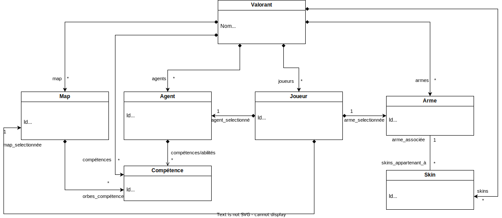

# Projet : Réalisation d'un serveur REST

## Introduction
Ce projet est un serveur REST sur le jeu Valorant. Ce dernier permet de lister différentes informations.

## Spécification du système
Le système est basé sur ce diagramme de classes. Valorant est la classe mère qui répertorie les informations de base de Valorant.
La classe Map possède les cartes dans Valorant. Chaque carte possède des orbes de compétences. 
Valorant possède des agents et eux aussi possèdent des compétences. 
Il y a les joueurs. Ils ont sélectionné une arme, une carte et un agent.
Chaque arme possède des skins qui lui appartiennent.



### Jeu de données
Les données utilisées sont des données officielles pour les maps, agents, compétences, armes et skins.
La classe joueur comme les liens entre a été généré avec chatgpt.

## Lancement du serveur
Pour lancer le serveur, se placer dans le repertoire nodejs-server et initialiser node :

```
npm install
```

Lancer le serveur avec la commande suivante : 
```
nodemon index.js
```

Accéder à l'interface sur le navigateur sur ce lien : 

```
http://localhost:8080/
```

## Méthodologie suivie
La spécification OpenAPI a été réalisée avant le serveur. 
Cela permettait de mettre le cadre global en listant toutes les routes qu'il fallait.
De ce fait, la réalisation du serveur, dont le squelette a été généré par Swagger, a été plus simple comme les différentes routes ont été préalablement définies.

